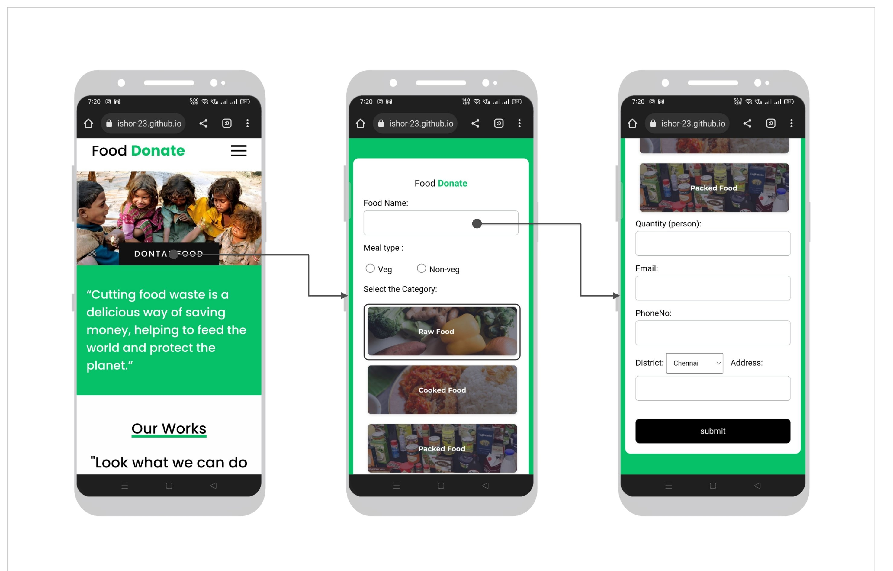
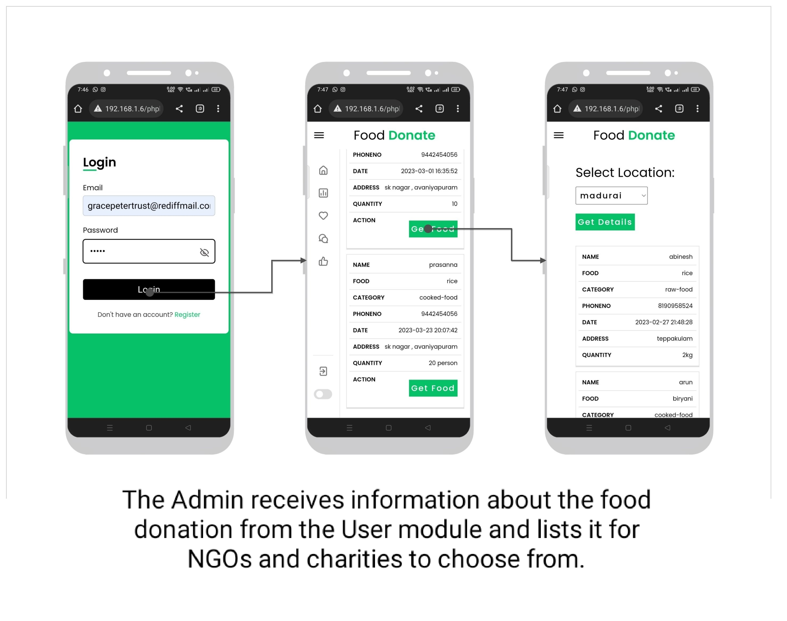
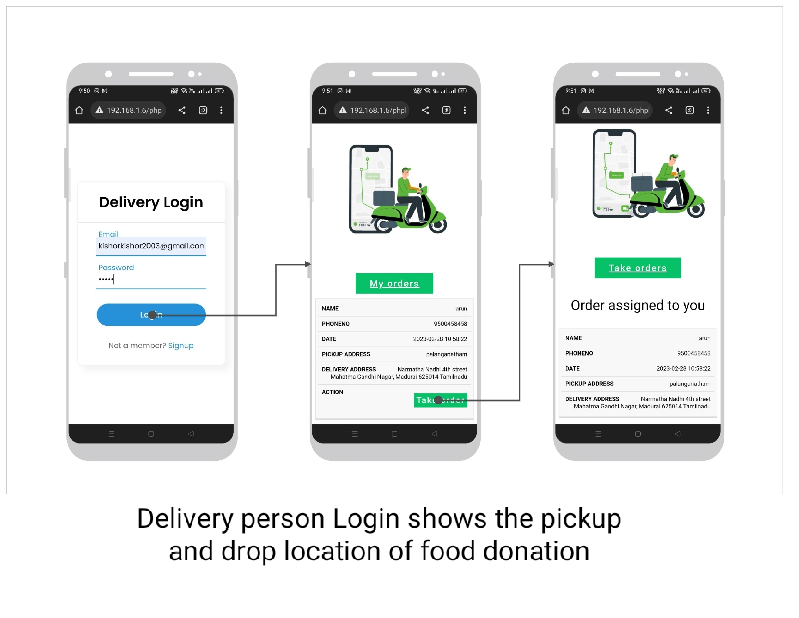
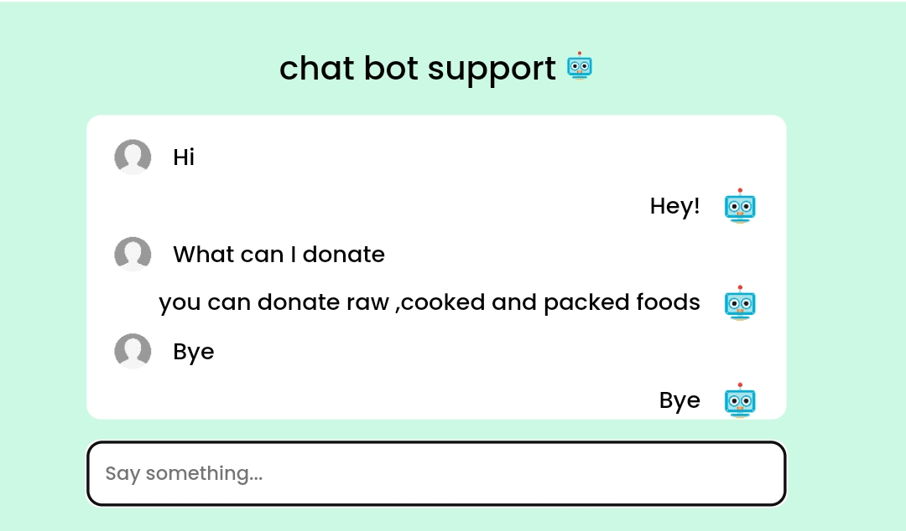
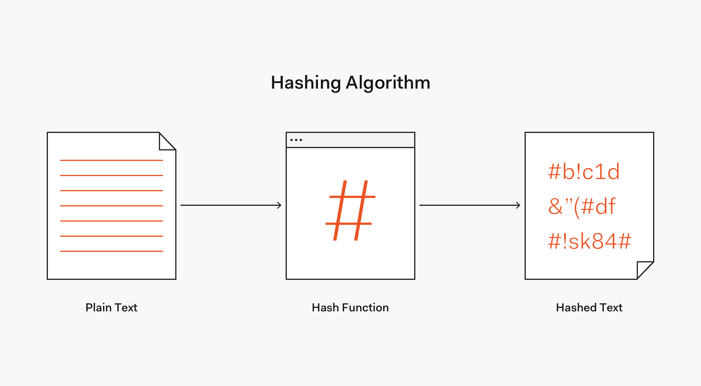

# Food Waste Management System

## 📖 About the Project

Food wastage is a major issue, especially after events, restaurants, and large gatherings where a significant amount of edible food is left unused. At the same time, many people struggle to access regular meals.

This project was developed as a solution to help bridge that gap by creating a platform where surplus food can be donated and distributed to people in need. The system allows donors to register food donations, enables NGOs to manage and request available donations, and helps delivery personnel coordinate pickups and deliveries.

The main objective of this project is to reduce food wastage while making the donation process simple, organised, and efficient.

---

## 🎯 Objectives

* Reduce food wastage by encouraging food donations.
* Connect food donors with NGOs and charitable organisations.
* Provide an organised process for collecting and distributing food.
* Improve transparency by tracking donations and deliveries.
* Create an easy-to-use web application for all users.

---

## 🛠️ Technologies Used

| Category     | Technology            |
| ------------ | --------------------- |
| Frontend     | HTML, CSS, JavaScript |
| Backend      | PHP                   |
| Database     | MySQL                 |
| Local Server | XAMPP                 |

---

## 👥 System Modules

The application consists of three main modules.

### 1. User Module

The User module is designed for people or organisations that want to donate excess food.

Users can:

* Register and log in
* Submit food donation details
* View their donation history
* Provide pickup information

Typical donors include:

* Restaurants
* Marriage halls
* Hotels
* Individuals

---

### 2. Admin Module

The Admin module is responsible for managing the entire donation process.

The administrator can:

* View all food donations
* Verify and manage donation requests
* Assign donations to NGOs
* Track donation status
* Manage users and delivery personnel

This module acts as the central management system for the application.

---

### 3. Delivery Module

The Delivery module is used by delivery personnel who transport food from donors to NGOs or beneficiaries.

Delivery personnel can:

* Register and log in
* View assigned pickup requests
* Check pickup and delivery locations
* Update delivery status

---

## ✨ Features

* Responsive website that works on desktop and mobile devices
* Secure user authentication
* Food donation management
* Admin dashboard for monitoring donations
* Delivery management
* Chatbot support for user assistance
* Simple and user-friendly interface

---

##  Screenshots

### User Module



### Admin Module



### Delivery Module



---

### Responsive Design


---

### Chatbot Support



---

### Secure Login



---

## 🚀 How to Run the Project

1. Download or clone this repository.
2. Copy the project folder into your XAMPP `htdocs` directory.
3. Start **Apache** and **MySQL** using the XAMPP Control Panel.
4. Open **PHPMyAdmin**.
5. Create a new MySQL database.
6. Import the `demo.sql` file from the `database` folder.
7. Open your browser and visit:

```text
http://localhost/folderName
```

Replace `folderName` with the name of your project folder.

---

## 📚 Learning Outcomes

Through this project, I gained practical experience in:

* Frontend web development using HTML, CSS, and JavaScript
* Backend development with PHP
* Database design and management using MySQL
* Performing CRUD operations
* Building authentication systems
* Connecting frontend, backend, and database components
* Developing a complete full-stack web application

---

## 🔮 Future Improvements

Some features that can be added in future versions include:

* Real-time donation tracking
* Google Maps integration for pickup locations
* SMS and email notifications
* AI-based food demand prediction
* Payment gateway for monetary donations
* Mobile application for Android and iOS

---

## 👨‍💻 Developed By

**Sujay Joshi**

Information Science & Engineering Student

Basaveshwar Engineering College, Bagalkote

---

## 📄 License

This project was developed as part of an academic engineering project for learning and educational purposes.
